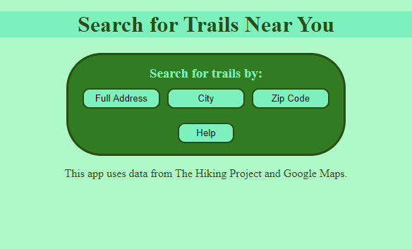
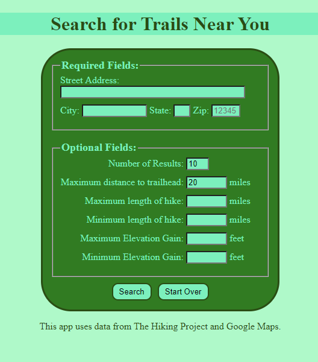
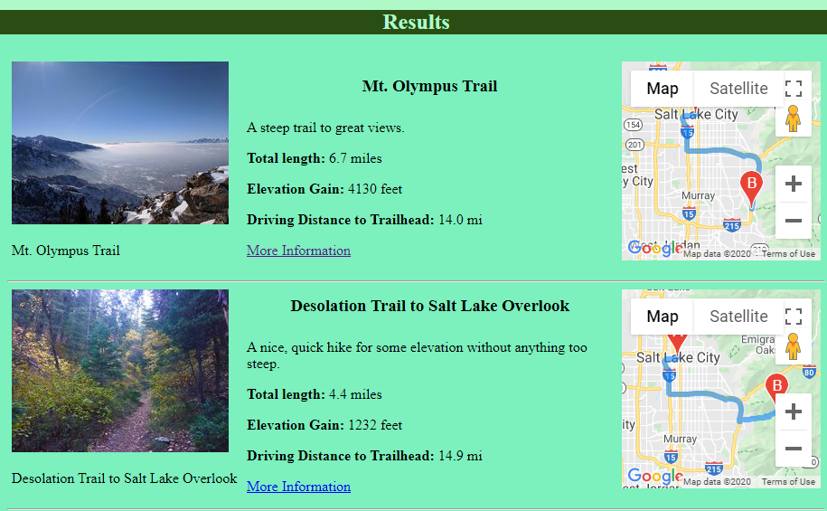

# Find Trails
<a>https://leojanas.github.io/find-trails/</a>

Created by Leo Janas in 2020.

The app uses HTML, CSS, Javascript, and JQuery.

This app accesses The Hiking Project API as well as Google Maps (Geocoding API and Directions Service) to provide a list of hiking trails close to a certain location.
It allows searching by an exact address, a city/state, or by zip code.  It also allows for filtering results with a minimum and maximum length of hike, as well as a 
minimum and maximum elevation gain on the hike. 

<h2>Screenshots</h2>
Home Screen

This is the home screen that users first see when using the app.

 
Search Screen

This is the main search screen.  The top section will be slightly different depending on the type of search.  

 
Results Screen

This is an example of the results dislpay.

 

